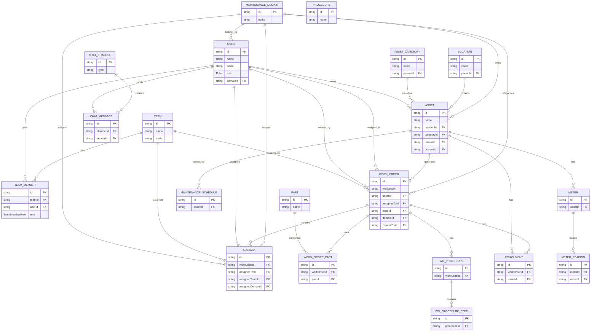

Here's a clean **Markdown (Mermaid ER Diagram)** for the core entities in your CMMS schema. You can paste this into GitHub, Obsidian, VS Code Markdown Preview, or Mermaid Live Editor.

# CMMS Database Structure



---

## High-Level Architecture

```text
                         Maintenance Domain
                                 │
             ┌───────────────────┼────────────────────┐
             │                   │                    │
          Users               Assets             Work Orders
             │                  │                     │
             │                  │                     │
      Team Members          Location              Assigned User
             │                  │                     │
             │                  │                     │
            Teams          Asset Category         Assigned Team
                                   │
                              Maintenance Schedule
                                   │
                               Procedures
                                   │
                           Work Order Procedures
                                   │
                               Procedure Steps

Work Order
 ├── Parts Used
 ├── Attachments
 ├── Comments
 ├── Subtasks
 ├── Status History
 ├── Repair Sessions
 └── Meter Readings

Asset
 ├── Meters
 ├── Meter Readings
 ├── Parts (BOM)
 ├── Attachments
 └── Maintenance Schedules

Users
 ├── Team Membership
 ├── Skills
 ├── Notifications
 ├── Chat Messages
 └── Work Orders

Chat
 ├── Channels
 ├── Members
 └── Messages
```

### Core flow of your system

```text
Domain
   │
   ▼
Asset Category ───────► Asset ◄──────── Location
                            │
                            ▼
                  Maintenance Schedule
                            │
                            ▼
                      Work Order
             ┌──────────┼────────────┐
             ▼          ▼            ▼
        Assigned User  Team      Procedures
             │                       │
             ▼                       ▼
         Subtasks             Procedure Steps
             │
             ▼
     Parts / Comments / Attachments
             │
             ▼
        Completion History
```

This represents the **main architecture** of your Prisma schema without overwhelming detail. The full schema contains ~50 models, but these are the central entities that almost everything revolves around.
